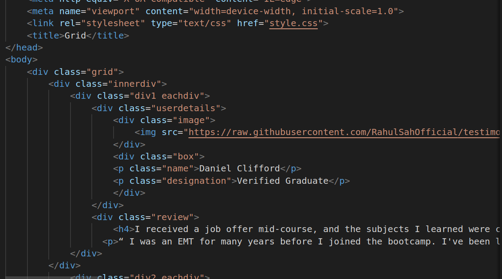
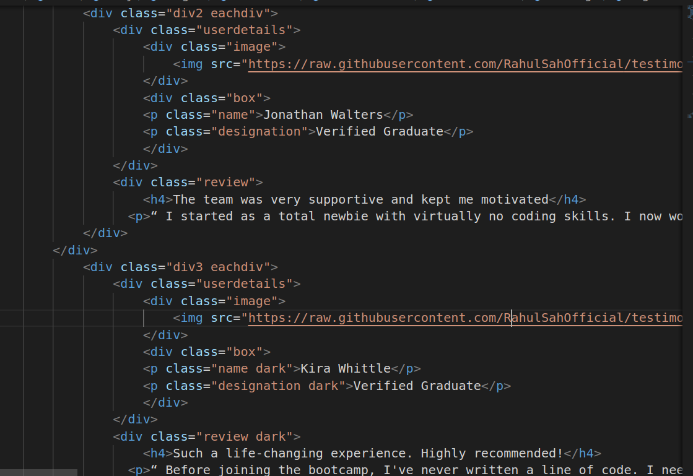
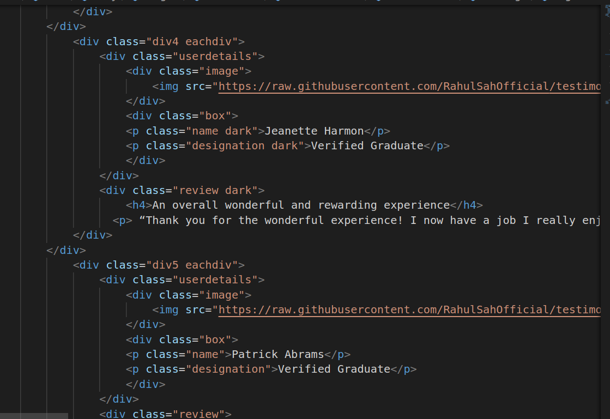
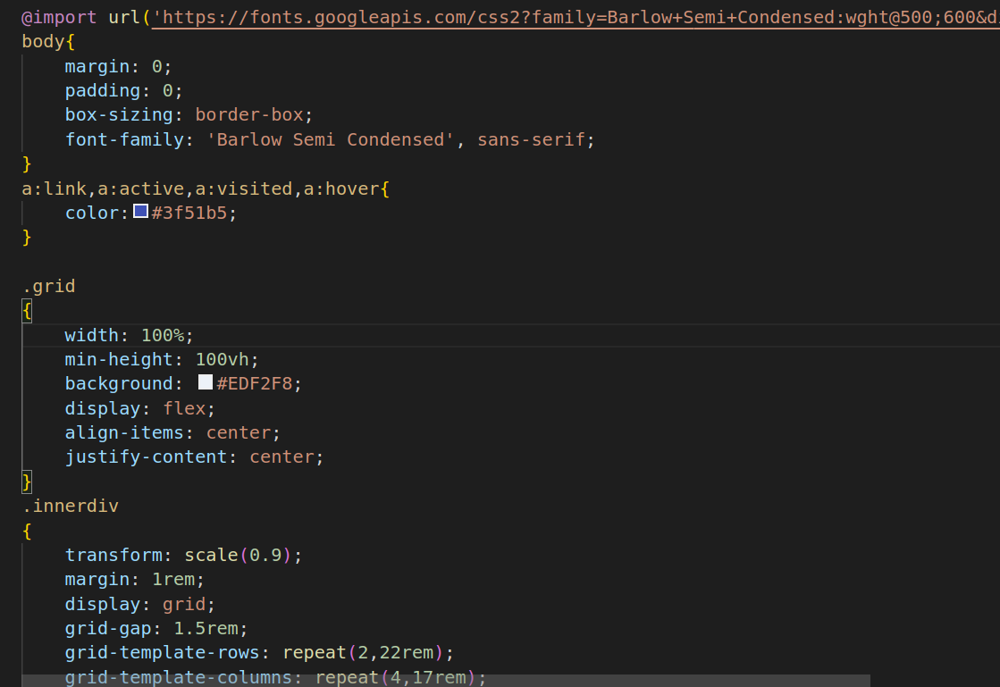
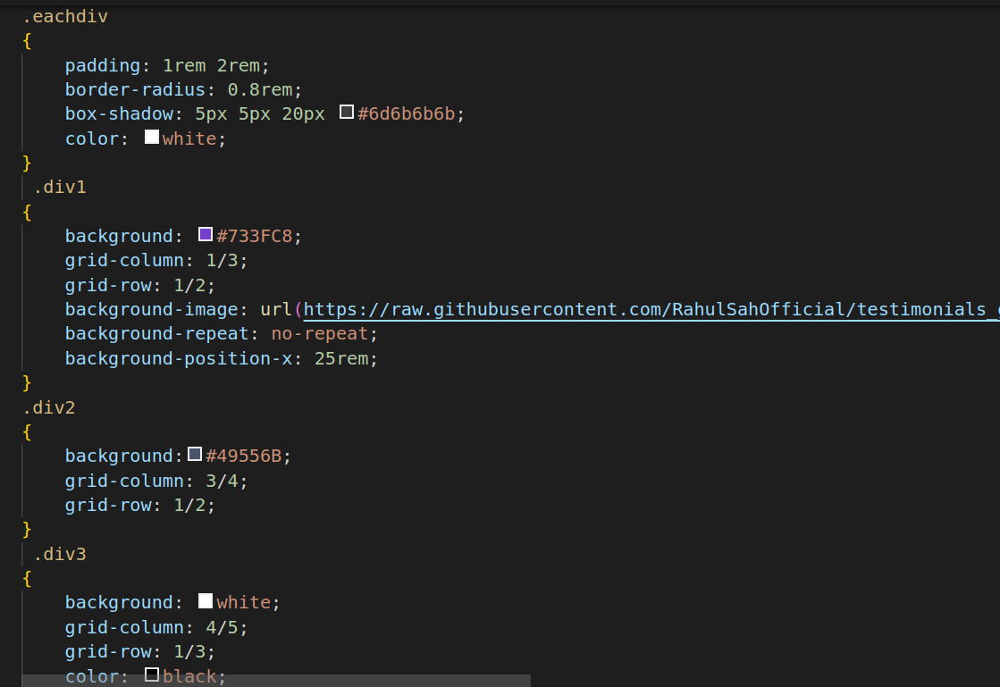
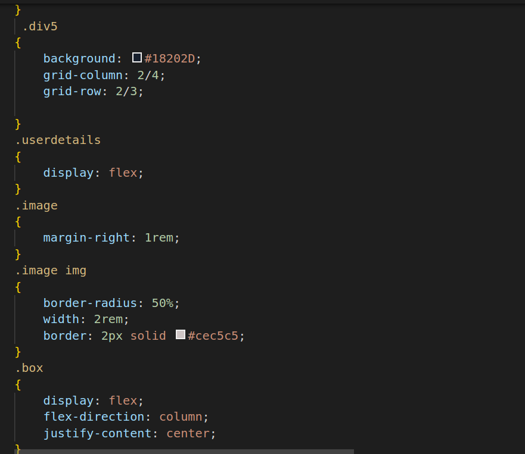
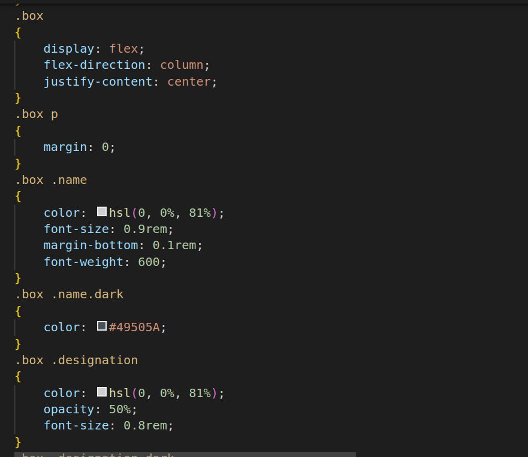
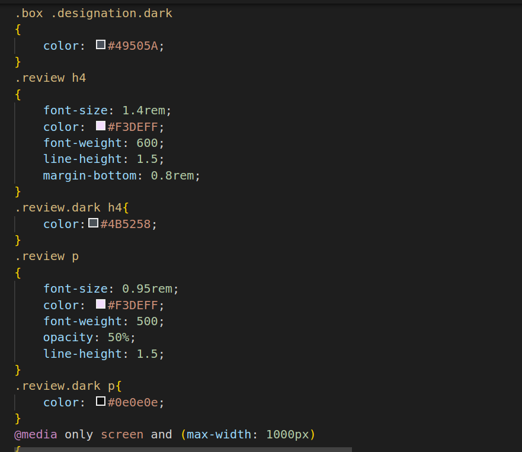
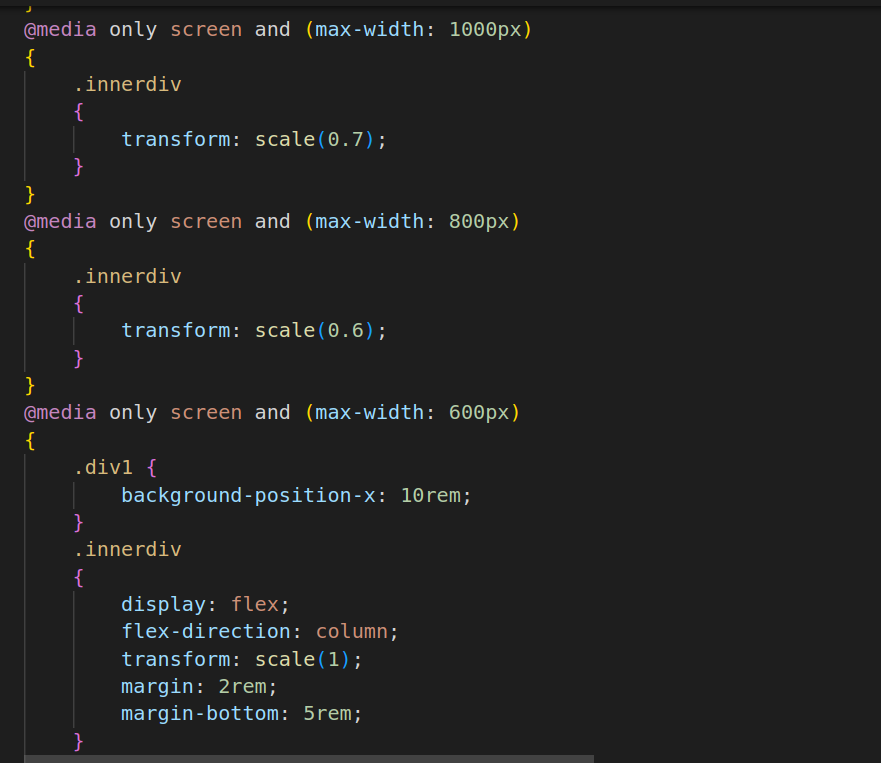

# Grid Template

1.

2.

3.

* link: This line is used to link an external CSS file named "style.css" to HTML document.
* div: This div element with the class "grid" appears to define a container or layout section on webpage. It's common to use div elements with specific classes or IDs to structure and style different sections of a webpage.
* Inside the "grid" div, there are multiple "div" elements with different classes like "div1," "div2," etc. These inner div elements seem to represent individual testimonials or review sections on your webpage.
* Each "div" element with the class "eachdiv" seems to represent a single testimonial or review block within the "grid."
* Inside each "eachdiv," there are sub-elements for displaying user details (name and designation), an image, and the actual review content. These elements are structured within nested div elements and use specific classes for styling.
* The img elements inside the "image" div contain image URLs, which display user profile pictures associated with each testimonial.
* The p elements are used for displaying text content, including user names, designations, and the review text.

4.

5.

* This line imports the "Barlow Semi Condensed" font from Google Fonts. It makes this font available for use throughout the webpage.
* The body selector applies styles to the entire document's body.
margin: 0; and padding: 0; remove any default margin and padding to ensure a consistent layout.
* box-sizing: border-box; sets the box-sizing model to "border-box," which means that padding and borders are included in the element's total width and height.
* font-family: 'Barlow Semi Condensed', sans-serif; specifies the font family for text in the body, using the imported "Barlow Semi Condensed" font or a generic sans-serif font if the imported font is unavailable.
* These selectors define styles for links in different states (normal, active, visited, and hover).
color: #3f51b5; sets the text color for links to a shade of blue (#3f51b5).
* The .grid class styles a container for the testimonial grid.
* width: 100%; ensures the container spans the entire width of its parent.
* min-height: 100vh; sets a minimum height of 100% viewport height, ensuring it covers the entire viewport.
* background: #EDF2F8; defines the background color for the container.
* display: flex; uses a flex display, allowing for flexible alignment and layout.
* align-items: center; centers items vertically.
* justify-content: center; centers items horizontally.
* The .innerdiv class styles a nested container within the grid.
transform: scale(0.9); scales the container down to 90% of its original size.
* margin: 1rem; adds margin around the container.
* display: grid; uses a grid display for layout.
* grid-gap: 1.5rem; sets a gap between grid items.
* grid-template-rows and grid-template-columns define the grid layout with rows and columns of specific sizes.
* .eachdiv class:
padding: 1rem 2rem; sets padding for elements with this class. The padding is 1 rem at the top and bottom and 2 rem on the left and right. This creates space around the content inside each .eachdiv element.
* border-radius: 0.8rem; rounds the corners of the element, giving it a slightly curved or "rounded" appearance.
* box-shadow: 5px 5px 20px #6d6b6b6b; adds a shadow effect to the element. The values represent horizontal and vertical offset (5 px), blur radius (20 px), and the shadow color (#6d6b6b6b, a grayish color). This creates a subtle shadow behind the element.
* color: white; sets the text color within elements with this class to white.
* .div1 class:
background: #733FC8; sets the background color of elements with this class to a shade of purple (#733FC8).
* grid-column: 1/3; specifies that this element occupies columns 1 and 2 in the grid.
* grid-row: 1/2; specifies that this element occupies the first row in the grid.
* background-image: url(...); sets a background image for this element. The URL points to an external image file (a quotation mark pattern).
* background-repeat: no-repeat; ensures that the background image is not repeated.
* background-position-x: 25rem; positions the background image horizontally with an offset of 25 rem from the left edge.
* div2 class:
background: #49556B; sets the background color of elements with this class to a shade of blueish-gray (#49556B).
* grid-column: 3/4; specifies that this element occupies the third column in the grid.
* grid-row: 1/2; specifies that this element occupies the first row in the grid.
* div3 class:
background: white; sets the background color of elements with this class to white.
* grid-column: 4/5; specifies that this element occupies the fourth column in the grid.
* grid-row: 1/3; specifies that this element occupies the first and second rows in the grid.
color: black; sets the text color within elements with this class to black.

6.

7.
* .div4 class:
background: white; sets the background color of elements with this class to white.
* grid-column: 1/2; specifies that this element occupies the first column in the grid.
* grid-row: 2/3; specifies that this element occupies the second row in the grid.
* color: black; sets the text color within elements with this class to black.
* .div5 class:
background: #18202D; sets the background color of elements with this class to a dark blueish-gray (#18202D).
* grid-column: 2/4; specifies that this element occupies the second and third columns in the grid.
* grid-row: 2/3; specifies that this element occupies the second row in the grid.
* .userdetails class:
display: flex; uses the Flexbox display property to create a flexible layout for elements with this class. This is typically used for arranging child elements horizontally in a row.
* image class:
margin-right: 1rem; adds a right margin of 1 rem to elements with this class. This creates spacing between the image and the adjacent content.
* image img selector:
border-radius: 50%; rounds the corners of images within elements with this selector, creating circular images.
* width: 2rem; sets a fixed width of 2 rem for the images.
border: 2px solid #cec5c5; adds a 2-pixel-wide solid border with a light gray color (#cec5c5) around the images.
* .box class:
display: flex; sets the display property to flex, making it a flex container.
* flex-direction: column; arranges the child elements in a column layout. In this context, it means that elements within .box will be stacked vertically.
* justify-content: center; centers the child elements vertically within the flex container. It vertically aligns the content in the middle of the container.
* box p selector:
margin: 0; removes the default margin from paragraphs within elements with the .box class. This ensures that there is no extra spacing around the paragraphs.
* .box .name selector:
color: hsl(0, 0%, 81%); sets the text color to a light grayish color.
* font-size: 0.9rem; defines the font size for elements with the .name class.
* margin-bottom: 0.1rem; adds a small margin at the bottom of elements with the .name class, creating spacing between the name and the subsequent element.
* font-weight: 600; sets the font weight to 600, making the text bold.
* box .name.dark selector:
This selector applies styles to elements with both the .box and .name.dark classes.
* color: #49505A; sets the text color to a specific dark color (#49505A).
* box .designation selector:
color: hsl(0, 0%, 81%); sets the text color for elements with the .designation class to a light grayish color.
* opacity: 50%; reduces the opacity of the text to 50%, making it semi-transparent.
* font-size: 0.8rem; defines the font size for elements with the .designation class.

8.

9.
* review h4 selector:
This selector applies styles to h4 elements within elements with the .review class.
* font-size: 1.4rem; sets the font size for h4 elements.
color: #F3DEFF; sets the text color to a specific light color (#F3DEFF).
* font-weight: 600; makes the text bold.
line-height: 1.5; sets the line height to 1.5 times the font size, improving readability.
* margin-bottom: 0.8rem; adds a margin at the bottom of the h4 element, creating space between it and the following content.
* .review.dark h4 selector:
This selector applies styles to h4 elements within elements with the .review.dark class when the design is in dark mode.
* color: #4B5258; sets the text color to a specific dark color (#4B5258).
* review p selector:
This selector applies styles to p elements within elements with the .review class.
* font-size: 0.95rem; sets the font size for p elements.
color: #F3DEFF; sets the text color to a specific light color (#F3DEFF).
* font-weight: 500; sets a medium font weight.
* opacity: 50%; reduces the text opacity to 50%, making it semi-transparent.
* line-height: 1.5; sets the line height to 1.5 times the font size.
* .review.dark p selector:
This selector applies styles to p elements within elements with the .review.dark class when the design is in dark mode.
* color: #0e0e0e; sets the text color to a specific dark color (#0e0e0e).
* These are media queries that define styles for specific screen widths, making webpage responsive to different screen sizes:
* When the screen width is 800 pixels or less, it targets elements with the class .innerdiv.
It scales down (shrinks) the .innerdiv elements to 60% of their original size using transform: scale(0.6);. This makes the content smaller and more suitable for narrower screens.
* When the screen width is 600 pixels or less, this media query applies styles to elements.
* It specifically targets .div1, setting the background-position-x property to 10rem. This shifts the background image for .div1 to the right by 10 rem.
* It also targets .innerdiv, making several adjustments:
It changes the display property to flex, allowing the child elements to be displayed in a column layout.
* transform: scale(1); resets the scale of .innerdiv to its original size (no scaling).
* It adds margins to the top and bottom of .innerdiv, providing spacing.
* margin-bottom: 5rem; adds a larger margin at the bottom, creating more space below .innerdiv.

